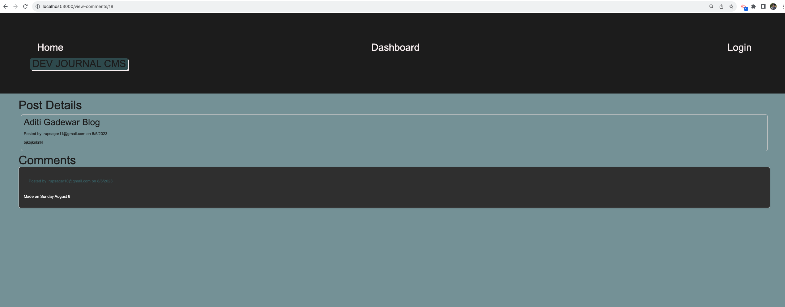

# dev-journal-cms

  
## Description 

Challenge is to build a CMS-style blog site similar to a Wordpress site, where developers can publish their blog posts and comment on other developers’ posts as well.
   

## User Story
AS A developer who writes about tech

I WANT a CMS-style blog site

SO THAT I can publish articles, blog posts, and my thoughts and opinions

## Table of contents

- [Description](#description)
- [Installation](#installation)
- [Usage](#usage)
- [license](#license)
- [Contributors](#contributors)
- [Tests](#tests)
- [Repository Link](#repository)
- [Questions](#questions)

## Installation
To install necesary dependencies, run the following command:

        npm i

## Usage

          node server.js

## license

## Contributors

https://github.com/rgadewar

## Tests
To run tests, run the following command:

          npm test

## Questions
If you have any questions about the repo, open an issue or contact me directly at email rupa@gadewar.com. You can find more of my work at
https://www.github.com/rgadewar

## Repository

- [Project Repo](https://github.com/rgadewar/dev-journal-cms)

## Heroku App

- https://dev-journal-cms-fb3b6f21d6e9.herokuapp.com/